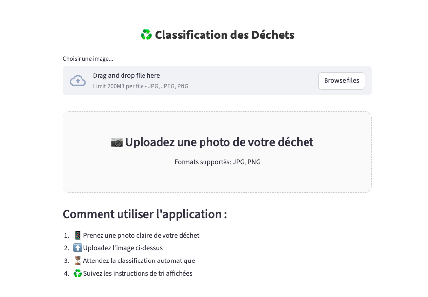

# 🗑️♻️ Garbage Classification - Deep Learning pour le Tri Intelligent des Déchets

Système de classification automatique des déchets ménagers utilisant le Deep Learning et les réseaux de neurones convolutionnels (CNN). Cette application permet d'identifier en temps réel la catégorie d'un déchet à partir d'une simple photo, facilitant ainsi le tri sélectif et contribuant à l'amélioration du recyclage.

## 📋 Contexte du Projet

À l'échelle mondiale, **2 milliards de tonnes de déchets** sont produites chaque année, mais seulement **13,5% sont recyclés**. Ce projet propose une solution d'intelligence artificielle pour optimiser le processus de tri en classifiant automatiquement les déchets en **6 catégories** :

- 📦 **Carton** (Cardboard)
- 🍾 **Verre** (Glass)
- 🥫 **Métal** (Metal)
- 📄 **Papier** (Paper)
- ♻️ **Plastique** (Plastic)
- 🗑️ **Ordures générales** (Trash)

## ✨ Fonctionnalités de l'Application

* **Classification en temps réel** avec affichage du résultat en moins de 3 secondes
* **Upload d'images** aux formats JPG, JPEG, PNG
* **Interface intuitive** de type mobile avec design épuré
* **Affichage détaillé** : catégorie du déchet, couleur du bac de tri, et score de confiance
* **Modèle optimisé** atteignant **88% de précision** sur les données de validation
* **Architecture basée sur Transfer Learning** (ResNet50, EfficientNet-B0)

## 🧠 Architecture Technique

### Stack Technique
- **Framework Deep Learning** : PyTorch avec torchvision
- **Frontend** : Streamlit
- **Modèles** : ResNet50 et EfficientNet-B0
- **Optimisation** : Optuna pour le tuning des hyperparamètres
- **Dataset** : 2527 images (source : Kaggle)

### Pipeline de Traitement
1. **Prétraitement** : Redimensionnement (224×224), normalisation
2. **Augmentation** : RandomHorizontalFlip, RandomRotation, ColorJitter
3. **Transfer Learning** : Fine-tuning de ResNet50 avec gel des premières couches
4. **Régularisation** : Dropout (0.5) pour prévenir le sur-apprentissage
5. **Inférence** : Classification avec affichage du score de confiance

## 📊 Performances du Modèle

### Métriques Globales (Modèle Final - ResNet50 avec Dropout)
- **Accuracy** : 88%
- **Recall moyen** : 91%
- **F1-Score moyen** : 88%
